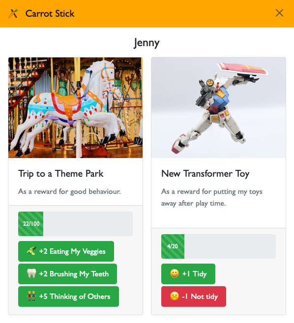
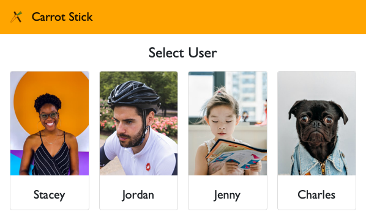
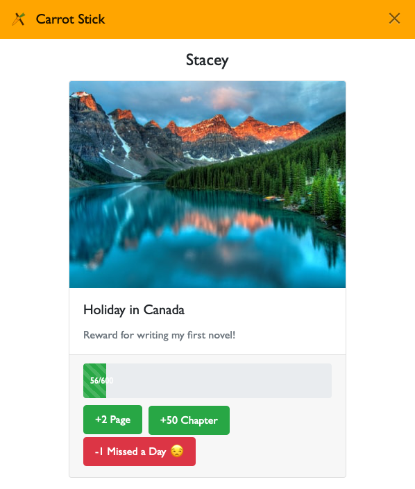
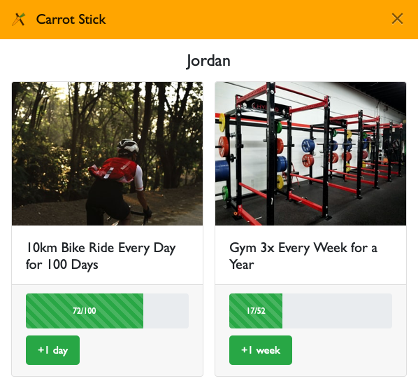
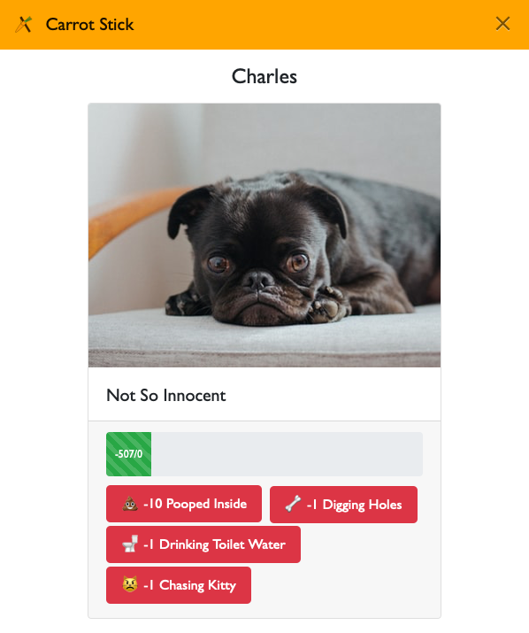

# Carrot Stick

Carrot Stick is a simple web app for visually tracking and incentivising progress towards goals.

It looks like this:

I built Carrot Stick to encourage good behaviours in my kids by using positive re-enforcement techniques. It celebrates small day to day wins and shows how they can work towards greater outcomes over time.

You can also use Carrot Stick for other scenarios. It works nicely as a habit tracker too.

## Features

- Multiple users (or a family)
- Multiple goals per user
- Custom score values e.g. 100 points, 30 days, 5 times, ...
- Custom button labels and values e.g. +5 for tidying room, +1 for brushing teeth, ... (you can include emojiis too)
- Optional audio jingles on button presses (adds to sense of reward/celebration)
- Works well / responsive on mobile devices

## Other Screenshots

Carrot Stick's user selection screen. You can configure the title to best describe your users.

If you're an author, you could use Carrot Stick to encourage daily writing and defeat procrastination.

If you're trying to establish new routines you could use Carrot Stick as a habit tracker.

If you have a naughty dog who poops inside or digs up the garden, you can measure just how naughty he is!

## Deployment Instructions

To get Carrot Stick setup you're best being/getting familiar with the world of [Docker](https://www.docker.com) and Docker Compose. Then you simply:

1. Clone this repo.
2. Take a look at containers/app/src/inc/config.php and tweak any changes.
3. Create a data file at containers/app/src/data/users.json. There are template and demo examples you can use to start with.
4. docker-compose -p carrotstick up -d

It's possible to deploy on a traditional PHP setup too, if you know what you're doing. The containers/app/src directory should be portable. Just make sure you install the package dependencies using [Composer](https://getcomposer.org). No database required.

## To Do

- **Admin interface.** Unfortunately, there's currently no UI for managing Carrot Stick. I built it rather quickly and as a time-poor Father of two, I've only had time to tidy up the code a bit, document and share here. For now you'll have to configure things manually with the JSON data file.
- **Remote image caching** is included already but is very barebones and not robust at all. What this does is... if you've included remote image URLs in your data file anywhere, and you set this flag in the config to true, Carrot Stick will attempt to download those remote images to your local deployment. It'll then update the data file references to relative links pointing locally. That way, if remote images disappear at any time, you've still got them. And things will probably load a bit quicker too. (But until this is improved you're best manually downloading images and setting relative references in the data file yourself. Or just leave them pointing to external sources.)
- **Unlimited score values.** Right now, if you don't really want a ceiling limit to a reward score, you have to set a really high number e.g. 9999999. It'd be nice to have a special "unlimited" or "infinite" value for such cases.
- **Finish state / reset.** What happens when you reach the goal? Try it and find out! (Spoiler: not much.) There's no handling of final state / goal reached. There's also no easy way in the UI to reset a reward. Right now, you'll need to manually edit the data file to do that.
- **Animation effects.** We have audio jingles but I'd really like some nice animated feedback when clicking those buttons too.

## Credits

- Included demo data (shown in screenshots) contains links to Unsplash photos by [ade tunji](https://unsplash.com/@iamdetunji), [James Wheeler](https://unsplash.com/@souvenirpixels), [Jordan Brierley](https://unsplash.com/@jordanbrierley), [loka studio](https://unsplash.com/@lokastudio), [George Pagan III](https://unsplash.com/@gpthree), [Jerry Wang](https://unsplash.com/@jerry_318), [Charlota Blunarova](https://unsplash.com/@charlotablunarova), [Jeffrey Ho](https://unsplash.com/@jefferyho) and [Charles Deluvio](https://unsplash.com/@charlesdeluvio).
- Included SFX audio clips for jingles are by [LittleRobotSoundFactory](https://freesound.org/people/LittleRobotSoundFactory/).